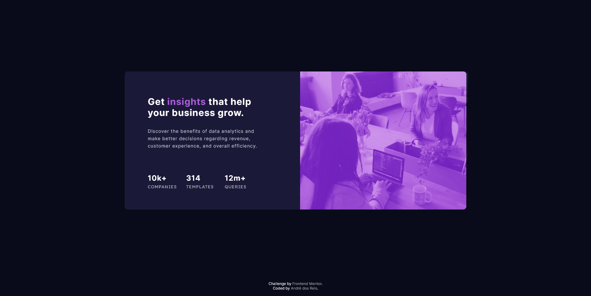

# Frontend Mentor - stats-preview-card-component

This is a solution to the [stats preview card component challenge on Frontend Mentor](https://www.frontendmentor.io/challenges/stats-preview-card-component-8JqbgoU62). Frontend Mentor challenges help you improve your coding skills by building realistic projects. 

## Table of contents

- [Overview](#overview)
  - [The challenge](#the-challenge)
  - [Screenshot](#screenshot)
  - [Links](#links)
- [My process](#my-process)
  - [Built with](#built-with)
  - [What I learned](#what-i-learned)
  - [Useful resources](#useful-resources)
- [Author](#author)
- [Acknowledgments](#acknowledgments)

## Overview

### The challenge

Users should be able to:

- View the optimal layout depending on their device's screen size
- See hover states for interactive elements

### Screenshot




### Links

- [Solution URL](https://github.com/andrebdosreis/FEM-NEW-stats-preview-card-component)
- [Live Site URL](https://andrebdosreis.github.io/FEM-NEW-stats-preview-card-component)

## My process

### Built with

- Semantic HTML5 markup
- CSS custom properties
- Flexbox
- Mobile-first workflow


### What I learned

• It was my first FrontEndMentor's challenge.
• I learned how to use and organize variables in CSS code:
```css
:root {
    --very-dark-blue: hsl(233, 47%, 7%);
    --dark-desaturated-blue: hsl(244, 38%, 16%);
    --soft-violet: hsl(277, 64%, 61%);
}
```

• I learned to work with flexbox and some flex-grid techniques. Some examples:
```css
    display: flex;
    flex-direction: column;
    grid-row: 1/2;
```

### Useful resources

- [B7 Web](https://www.b7web.com.br) - B7Web is an online web developer course from Brazil. So i learned how to write HTML and CSS codes studying B7Web's classes.

## Author

- Website - [André dos Reis](https://www.andredosreis.com.br)
- Frontend Mentor - [@andrebdosreis](https://www.frontendmentor.io/profile/andrebdosreis)
- Twitter - [@andrebdosreis](https://www.twitter.com/andrebdosreis)

## Acknowledgments

Thanks FrontEndMentor.io for challenge. I'm learning a lot with you.
